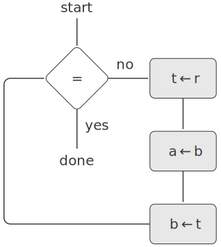

[toc]

# 第一章 构造过程抽象

> 心智的活动，除了尽力产生各种简单的认识之外，主要表现在如下三个方面：
> 1. 将若干简单认识组合为一个复合认识，由此产生出各种复杂的认识。
> 2. 将两个认识放在一起对照，不管它们如何简单或者复杂，在这样做时并不将它们合而为一。由此得到有关它们的相互关系的认识。
> 3. 将有关认识与那些在实际中和它们同在的所有其他认识隔离开，这就是抽象，所有具有普遍性的认识都是这样得到的。
>
> — 约翰·洛克，《人类理解研究》，$1690$年

我们准备学习的是有关 **计算过程** 的知识。计算过程是存在于计算机里的一类抽象事物，在其演化过程中，这些过程会去操作一些被称为 **数据** 的抽象事物。人们创建出一些称为 **程序** 的规则模式，以知道这类过程的进行。从作用上看，就像是我们在通过自己的写作魔力去控制计算机里的精灵似的。

一个计算过程确实很像一种神灵的巫术，它看不见也摸不到，根本就不是由物质组成的。然而它却又是非常真实的，可以完成某些智力性的工作。它可以回答提问，可以通过在银行里支付现金或者在工厂里操纵机器人等等方式影响这个世界。我们用于指挥这种过程的程序就像是巫师的咒语，它们是用一些诡秘而深奥的 **程序设计语言** ，通过符号表达式的形式精心编排而成，它们描述了我们希望相应的计算过程去完成的工作。

在正常工作的计算机里，一个计算过程将精密而准确地执行相应的程序。这样，初学程序设计的人们就像巫师的徒弟们那样，必须学习如何去理解和预期他们所发出的咒语的效果。程序里即使有一点小错误（常常被称为 **程序错误（$bug$）** 或者 **故障（$glitch$）** ），也可能产生复杂而无法预料的后果。

幸运的是，学习程序的危险性远远小于学习巫术，因为我们要去控制的神灵以一种很安全的方式被约束着。而真实的程序设计则需要极度细心，需要经验和智慧。例如，在一个计算机辅助设计系统里的一点小毛病，就可能导致一架飞机或者一座水坝的灾难性损毁，或者一个工业机器人的自我破坏。

软件工程大师们能组织好自己的程序，使自己能合理地确信这些程序所产生的计算过程将能完成预期的工作。他们可以事先看到自己系统的行为方式，知道如何去构造这些程序，使其中出现的意外问题不会导致灾难性的后果。而且，在发生了这种问题时，他们也能 **排除** 程序中的错误，设计良好的计算系统就像设计良好的汽车或者核反应堆一样，具有某种模块化的设计，其中的各个部分都可以独立地构造、替换、排除错误。

**用 $Lisp$ 编程**

为了描述这类计算过程，我们需要有一种适用的语言。我们将为此使用程序设计语言 Lisp 。正如人们每天用自然语言（如英语、法语或日语等）表述自己的想法，用数学形式的记法描述定量的现象一样，我们将要用 $Lisp$ 表述过程性的思想。$Lisp$ 是 $20$ 世纪 $50$ 年代后期发明的一种记法形式，是为了能对某种特定形式的逻辑表达式（称为 **递归方程** ）的使用做推理。递归方程可以作为计算的模型。这一语言是由 $John \; McCarthy$ 设计的，基于他的论文《符号表达式的递归函数及其机械计算》。

虽然在开始时， McCarthy 是想以 $Lisp$ 作为一种数学记述形式，但它确实是一种实用的程序设计语言。一个 Lisp **解释器** 就像是一台机器，它能实现用 $Lisp$ 语言描述的计算过程。第一个 $Lisp$ 解释器是 $McCarthy$ 在 $MIT$ 电子研究实验室的人工智能组和 $MIT$ 计算中心里他的同事和学生的帮助下实现的[^1]。 Lisp 的名字来自表处理（$LISt \; Processing$），其设计是为了提供符号计算的能力，以便能用于解决一些程序设计问题，例如代数表达式的符号微分和积分。它包含了适用于这类目的的一些新数据对象，称为原子和表，这是它与那一时代的所有其他语言之间最明显的不同之处。

$Lisp$ 并不是一个刻意的设计努力的结果，它以一种试验性的非正式的方式不断演化，以满足用户的需要和实际实现的各种考虑。 $Lisp$ 的这种非官方演化持续了许多年， $Lisp$ 用户社团具有抵制制定这一语言的“官方”定义企图的传统。这种演化方式以及语言初始概念的灵活和优美，使得 $Lisp$ 成为今天还在广泛使用的历史第二悠久的语言（只有 $Fortran$ 比它更老。）这一语言还在不断调整，以便去包容有关程序设计的最新思想。正因为这样，今天的 Lisp 已经形成了一族方言，它们共享着初始语言的大部分特征，也可能有这样或那样的重要差异。用于本书的 $Lisp$ 方言名为 $Scheme$[^2] 。

由于 $Lisp$ 的试验性质以及强调符号操作的特点，开始时的这个语言对于数值计算而言是很低效的，至少与 $Fortran$ 比较时是这样。经过这么多年的发展，人们已经开发出了 $Lisp$ 编译器，它们可以将程序翻译为机器代码，这样的代码能相当高效地完成各种数值计算。$Lisp$ 已经可以非常有效地用于一些特殊的应用领域[^3]。虽然 $Lisp$ 还没有完全战胜有关它特别低效的诋毁，但它现在已被用于许多性能并不是最重要考虑因素的应用领域。例如， $Lisp$ 已经成为操作系统外壳语言（$shell$）的一种选择，作为编辑器（$Emacs \; Lisp$）和计算机辅助设计系统的扩充语言等等。

既然 $Lisp$ 并不是一种主流语言，我们为什么要用它作为讨论程序设计的基础呢？这是因为，这一语言具有许多独有的特征，这些特征使它成为研究重要程序的设计、构造，以及各种数据结构，并将其关联于支持它们的语言特征的一种极佳媒介。这些特征之中最重要的就是：计算过程的 $Lisp$ 描述（称为 **过程** ）本身又可以作为 $Lisp$ 的数据来表示和操作。这一事实的重要性在于，现存的许多威力强大的程序设计技术，都依赖于填平在“被动的”数据和“主动的”过程之间的传统划分。正如我们将要看到的， $Lisp$ 可以将过程作为数据进行处理的灵活性，使它成为探索这些技术的最方便的现存语言之一。能将过程表示为数据的能力，也使 $Lisp$ 成为编写那些必须将其他程序当作数据去操作的程序的最佳语言，例如支持计算机语言的解释器和编译器。除了这些考虑之外，用 $Lisp$ 编程本身也是极其有趣的。

[^1]: Lisp 1 Programmer's Manual 在 1960 年发表， Lisp 1.5 Programmer's Manual (McCarthy 1965) 在 1962 年发表。有关 Lisp 的早期历史见 McCarthy 1978 。

[^2]: 在 20 世纪 70 年代，最主要的两个 Lisp 方言是 MIT 的 MAC 项目中开发的 MacLisp （Moon 1978；Pitman 1983），以及在 Bolt Beranek and Newman Inc. 和 Xerox Palo Alto Research Center 开发的 Interlisp （Teitelman 1974），那时主要的 Lisp 程序都是它们写的。Portable Standard Lisp （Hearn 1969；Griss 1981）是另一种 Lisp 方言，其设计就是为能更容易地移植到不同的计算机上。MacLisp 又发展出一些子方言，例如加州大学伯克利分校开发的 Franz Lisp ，还有 ZetaLisp （Moon 1981），它基于 MIT 人工智能实验室设计的一种专用处理器，这一处理器可以非常高效地运行 Lisp。本书所用的 Lisp 方言称为 Scheme （Steele 1975），是 1975 年由 MIT 人工智能实验室的 Guy Lewis Steele Jr. 和 Gerald Jay Sussman 设计的，后来在 MIT 为了教学使用而重新实现。在 1990 年 Scheme 变成了 IEEE 标准（IEEE 1990）。 Common Lisp 方言 （Steele 1982，Steele 1990）是由 Lisp 社团综合了早前各种 Lisp 方言的特征而开发出来的，希望能做成 Lisp 的工业标准。Common Lisp 在 1994 年成为 ANSI 标准（ANSI 1994）。

[^3]: 这方面有一个应用是科学计算的重要突破—有关太阳系统运动的整合，它将以前的结果提高了两个数量级，并显示出太阳系统动力学的混沌性。完成这一计算依靠了一种新的整合算法，一个特殊的编译器以及一台专用计算机，所有这些都是在用 Lisp 写的软件工具的帮助下实现的（Abelson et al. 1992；Sussman 和 Wisdom 1992）。

## $1.1$ 程序设计的基本元素

一个强有力的程序设计语言，不仅是一种指挥计算机执行任务的方式，它还应该成为一种框架，使我们能够在其中组织自己有关计算过程的思想。这样，当我们描述一个语言时，就需要将注意力特别放在这一语言所提供的，能够将简单的认识组合起来形成更复杂认识的方法方面。每一种强有力的语言都为此提供了三种机制。

- **基本表达形式** ，用于表示语言所关心的最简单的个体。
- **组合的方法** ，通过它们可以从较简单的东西出发构造出复合的元素。
- **抽象的方法** ，通过它们可以为复合对象命名，并将它们当作单元去操作。

在程序设计中，我们需要处理两类要素：过程和数据（以后读者将会发现，它们实际上并不是这样严格分离的）。非形式地说，数据是一种我们希望去操作的“东西”，而过程就是有关操作这些数据的规则的描述。这样，任何强有力的程序设计语言都必须能表述基本的数据和基本的过程，还需要提供对过程和数据进行组合和抽象的方法。

本章只处理简单的数值数据，这就使我们可以把注意力集中到过程构造的规则方面[^4]。在随后几章里我们将会看到，用于构造过程的这些规则同样也可以用于操作各种数据。

[^4]: 将数值作为“简单数据”看待实际上完全是一种虚张声势。事实上，对于数值的处理是任何程序设计语言里最错综复杂而且也是最迷惑人的事项之一，其中涉及的典型问题包括，某些计算机系统区分了 **整数** （例如 `2` ）和 **实数** （例如 `2.71` ）。那么实数 `2.00` 和整数 `2` 不同吗？用于整数的算术运算是否与用于实数的运算相同呢？用 `6` 除以 `2` 的结果是 `3` 还是 `3.0` ？我们可以表示的最大的数是多少？最多能表示的精度包含了多少个十进制位？整数的表示范围与实数一样吗？显然，上述这些问题以及许多其他问题，都会带来有关舍入和截断误差的一系列问题—这就是数值分析的整个科学领域，因为我们在本书中主要关心的是大规模程序的设计，而不是数值技术，因此将忽略对这些问题的讨论。本章中有关数值的实例将没有常规的舍入动作，而如果对非整数使用具有有限的十进制位数精度的算术运算，就会看到这方面的情况。

### $1.1.1$ 表达式

开始做程序设计，最简单的方式就是去观看一些与 $Lisp$ 方言 $Scheme$ 解释器交互的典型实例。设想你坐在一台计算机的终端前，用键盘输入了一个 **表达式** ，解释器的响应就是将它对这一表达式的 **求值** 结果显示出来。

你可以键入的一种基本表达式就是数（更准确地说，你键入的是由数字组成的表达式，它表示的是以 $10$ 作为基数的数）。如果你给 $Lisp$ 一个数

```
486
```

解释器的响应是打印出

```
486
```

可以用表示基本过程的表达形式（例如 `+` 或者 `*` ），将表示数的表达式组合起来，形成复合表达式，以表示求要把有关过程应用于这些数。例如：

```
(+ 137 349)
486

(- 1000 334)
666

(* 5 99)
495

(/ 10 5)
2

(+ 2.7 10)
12.7
```

像上面这样的表达式称为 **组合式** ，其构成方式就是用一对括号括起来一些表达式，形成一个表，用于表示一个过程应用。在表里最左的元素称为 **运算符** ，其他元素都称为 **运算对象** 。要得到这种组合式的值，采用的方式就是将由运算符所刻画的过程应用于有关的 **实际参数** ，而所谓实际参数也就是那些运算对象的值。

将运算符放在所有运算对象左边，这种形式称为 **前缀** 表示。刚开始看到这种表示时会感到有些不习惯，因为它与常规数学表示差别很大。然后前缀表示也有一些有点，其中之一就是它完全适用于可能带有任意个实参的过程，例如在下面实例中的情况：

```
(+ 21 35 12 7)
75

(* 25 4 12)
1200
```

在这里不会出现歧义，因为运算符总是最左边的元素，而整个表达式的范围也由括号界定。

前缀表示的第二个优点是它可以直接扩充，允许出现组合式 **嵌套** 的情况，也就是说，允许组合式的元素本身又是组合式：

```
(+ (* 3 5) (- 10 6))
19
```

原则上讲，对于这种嵌套的深度，以及 $Lisp$ 解释器可以求值的表达式的整体复杂度，都没有任何限制。倒是我们自己有可能被一些并不很复杂的表达式搞糊涂，例如：

```
(+ (* 3 (+ (* 2 4) (+ 3 5))) (+ (- 10 7) 6))
```

对于这个表达式，解释器可以马上求值出 `57` 。将上述表达式写成下面的形式有助于阅读：

```
(+ (* 3
      (+ (* 2 4)
         (+ 3 5)))
   (+ (- 10 7)
      6))
```

这就是遵循一种称为 **美观打印** 的格式规则。按照这种规则，在写一个很长的组合式时，我们令其中的各个运算对象垂直对齐。这样缩格排列的结果能很好地显示出表达式的结构。

即使对于非常复杂的表达式，解释器也总是按同样的基本循环运作：从终端读入一个表达式，对这个表达式求值，而后打印出得到的结果。这种运作模式常常被人们说成是解释器运行在一个 **读入—求值—打印 循环** 之中。请特别注意，在这里完全没有必要显式地去要求解释器打印表达式的值。

### $1.1.2$ 命名和环境

程序设计语言中一个必不可少的方面，就是它需要提供一种通过名字去使用计算对象的方式。我们将名字标识符称为 **变量** ，它的 **值** 也就是它所对应的那个对象。

在 $Lisp$ 方言 $Scheme$ 里，给事物命名通过 `define` （定义）的方式完成，输入：

```
(define size 2)
```

会导致解释器将值 `2` 与名字 `size` 相关联。一旦名字 `size` 与 `2` 关联之后，我们就可以通过这个名字去引用值 `2` 了：

```lisp
size
2

(* 5 size)
10
```

下面是另外几个使用 `define` 的例子：

```lisp
(define pi 3.14159)

(define radius 10)

(* pi (* radius radius))
314.159

(define circumference (* 2 pi radius))

circumference
62.8318
```

`define` 是我们所用的语言里最简单的抽象方法，它允许我们用一个简单的名字去引用一个组合运算的结果，例如上面算出的 `circumference` 。一般而言，计算得到的对象完全可以具有非常复杂的结构，如果每次需要使用它们时，都必须记住并重复地写出它们的细节，那将是极端不方便的事情。实际上，构造一个复杂的程序，也就是为了去一步步地创建出越来越复杂的计算性对象。解释器使这种逐步的程序构造过程变得非常方便，因为我们可以通过一系列交互式动作，逐步创建起所需要的名字—对象关联。这种特征鼓励人们采用递增的方式去开发和调试程序。在很大程度上，这一情况也出于另一个事实，那就是，一个 $Lisp$ 程序通常总是由一大批相对简单的过程组成的。

应该看到，我们可以将值与符号关联，而后又能提取出这些值，这意味着解释器必须维护某种存储能力，以便保持有关的名字—值对偶的轨迹。这种存储被称为 **环境** （更精确地说，是 **全局环境** ，因为我们以后将看到，在一个计算过程中完全可能涉及若干不同环境）。

### $1.1.3$ 组合式的求值

本章的一个目标，就是要把与过程性思维有关的各种问题隔离出来。现在让我们考虑组合式的求值问题。解释器本身就是按照下面过程工作的。

- 要求值一个组合式，做下面的事情：

1. 求值该组合式的各个子表达式。
2. 将作为最左子表达式（运算符）的值的那个过程应用于相应的实际参数，所谓实际参数也就是其他子表达式（运算对象）的值。

即使是一条这样简单的规则，也显示出计算过程里的一些具有普遍性的重要问题。首先，由上面的第一步可以看到，为了实现对一个组合式的求值过程，我们必须先对组合式里的每个元素执行同样的求值过程。因此，在性质上，这一求值过程是递归的，也就是说，它在自己的工作步骤中，包含着调用这个规则本身的需要。

在这里应该特别注意，采用递归的思想可以多么简洁地描述深度嵌套的情况。如果不用递归，我们就需要把这种情况堪称相当复杂的计算过程。例如，对下列表达式求值：

```
(* (+ 2 (* 4 6))
   (+ 3 5 7))
```

需要将求值规则应用于 4 个不同的组合式。如图 1-1 中所示，我们可以采用一棵树的形式，用图形表示这一组合式的求值过程，其中的每个组合式用一个带分支的结点表示，由它发出的分支对应于组合式里的运算符和各个运算对象。终端结点（即那些不再发出分支的结点）表示的是运算符或者数值。以树的观点看这种求值过程，可以设想那些运算对象的值向上穿行，从终端结点开始，而后在越来越高的层次中组合起来。一般而言，我们应该把递归看作一种处理层次性结构的（像树这样的对象）极强有力的技术。事实上，“值向上穿行”形式的求值形式是一类更一般的计算过程的一个例子，这种计算过程称为 **树形积累** 。

<figure>
    
    <figcaption style="text-align: center;">图 1-1 树形表示方法，其中显示了每个子表达式的值</figcaption>
</figure>

进一步的观察告诉我们，反复地应用第一个步骤，总可以把我们带到求值中的某一点，在这里遇到的不是组合式而是基本表达式，例如数、内部运算符或者其他名字。处理这些基础情况的方式如下规定：

- 数的值就是它们所表示的数值。
- 内部运算符的值就是能完成相应操作的机器指令序列。
- 其他名字的值就是在环境中关联于这一名字的那个对象。

我们可以将第二种规定看作是第三种规定的特殊情况，为此秩序将像 `+` 和 `*` 一类的运算符也包含在全局环境里，并将相应的指令序列作为与之关联的“值”。对于初学者，应该指出的关键一点是，环境所扮演的角色就是用于确定表达式中各个符号的意义。在如 Lisp 这样的交互式语言里，如果没有关于有关环境的任何信息，那么说例如表达式 `(+ x 1)` 的值是毫无意义的，因为需要有环境为符号 `x` 提供意义（甚至需要它为符号 `+` 提供意义）。正如我们将要在第 3 章看到的，环境具有普遍性的概念，它为求值过程的进行提供了一种上下文，对于我们理解程序的执行起着极其重要的作用。

请注意，上面给出的求值规则并没有处理定义。例如，对 `(define x 3)` 的求值并不是将 `define` 应用于它的两个实际参数：其中的一个是符号 `x` 的值，另一个是 `3` 。这是因为 `define` 的作用就是为 `x` 关联一个值（也就是说， `(define x 3)` 并不是一个组合式）。

一般性求值规则的这种例外称为 **特殊形式** ， `define` 是至今我们已经看到的唯一的一种特殊形式，下面还将看到另外一些特殊形式。每个特殊形式都有其自身的求值规则，各种不同种类的表达式（每种有着与之相关联的求值规则）组成了程序设计语言的语法形式。与大部分其他程序设计语言相比， $Lisp$ 的语法非常简单。也就是说，对各种表达式的求值规则可以描述为一个简单的通用规则和一组针对不多的特殊形式的专门规则。

### $1.1.4$ 复合过程

我们已经看到了 $Lisp$ 里的某些元素，它们必然也会出现在任何一种强有力的程序设计语言里。这些东西包括：

- 数和算术运算是基本的数据和过程。
- 组合式的嵌套提供了一种组织起多个操作的方法。
- 定义是一种受限的抽象手段，它为名字关联相应的值。

现在我们来学习 **过程定义** ，这是一种威力更加强大的抽象技术，通过它可以为复合操作提供名字，而后就可以将这样的操作作为一个单元使用了。

现在我们要考察如何表述“平方”的想法。我们可能想说“求某个东西的平方，就是用它自身去乘以它自身”。在这个语言里，这件事情应该表述为：

```lisp
(define (square x) (* x x))
```

可以按如下方式理解这一描述：

```
(define (square  x)       (*     x     x))
 |       |       |         |     |     |
 去      平方    某个东西  乘起  它 和 它自身
```

这样我们就有了一个 **复合过程** ，给它取的名字是 `square` 。这一过程表示的是将一个东西乘以它自身的操作。被乘的东西也给定了一个局部名字 `x` ，它扮演这与自然语言里代词同样的角色。求值这一定义的结果是创建起一个复合过程，并将它关联于名字 `square` 。

过程定义的一般形式是：

```
(define (<name> <formal parameters>) <body>)
```

其中 `<name>` 是一个符号，过程定义将在环境中关联于这个符号。 `<formal parameters>` （形式参数）是一些名字，它们用在过程体中，用于表示过程应用时与它们对应的各个实际参数。 `<body>` 是一个表达式，在应用这一过程时，这一表达式中的形式参数将用与之对应的实际参数取代，对这样取代后的表达式里的求值，产生出这个过程应用的值。 `<name>` 和 `<formal parameters>` 被放在一对括号里，成为一组，就像实际调用被定义过程时的写法。

定义好 `square` 之后，我们就可以使用它了：

```lisp
(square 21)
441

(square (+ 2 5))
49

(square (square 3))
81
```

我们还可以用 `square` 作为基本构件去定义其他过程。例如， $x^2 + y^2$ 可以表述为：

```
(+ (square x) (square y))
```

现在我们很容易定义一个过程 `sum-of-squares` ，给它两个数作为实际参数，让它产生这两个数的平方和：

```lisp
(define (sum-of-squares x y)
  (+ (square x) (square y)))

(sum-of-squares 3 4)
25
```

现在我们又可以用 `sum-of-squares` 作为构件，进一步去构造其他过程：

```
(define (f a)
  (sum-of-squares (+ a 1) (* a 2)))

(f 5)
136
```

复合过程的使用方式与基本过程完全一样。实际上，如果人们只看上面 `sum-of-squares` 的定义，根本就无法分辨出 `square` 究竟是（像 `+` 和 `*` 那样）直接做在解释器里呢，还是被定义为一个复合过程。

### $1.1.5$ 过程应用的代换模型

为了求值一个组合式（其运算符是一个复合过程的名字），解释器的工作方式将完全按照 $1.1.3$ 节中所描述的那样，采用与以运算符名为基本过程的组合式一样的计算过程，也就是说，解释器将对组合式的各个元素求值，而后将得到的那个过程（也就是该组合式里运算符的值）应用于那些实际参数（即组合式里那些运算对象的值）。

我们可以假定，把基本运算符应用于实参的机制已经在解释器里做好了。对于复合过程，过程应用的计算过程是：

- 将复合过程应用于实际参数，就是在将过程体中的每个形参用相应的实参取代之后，对这一过程体求值。

为了说明这种计算过程，让我们看看下面组合式的求值：

```
(f 5)
```

其中的 `f` 是 1.1.4 节定义的那个过程。我们首先提取出 `f` 的体：

```
(sum-of-squares (+ a 1) (* a 2))
```

而后用实际参数 `5` 代换其中的形式参数：

```
(sum-of-squares (+ 5 1) (* 5 2))
```

这样，问题就被归约为对另一个组合式的求值，其中有两个运算对象，有关的运算符是 `sum-of-squares` 。求值这一组合式牵涉到三个子问题：我们必须对其中的运算符求值，以便得到应该去应用的那个过程，还需要求值两个运算对象，以得到过程的实际参数。这里的 `(+ 5 1)` 产生出 `6` ， `(* 5 2)` 产生出 `10` ，因此我们就需要将 `sum-of-squares` 过程用于 `6` 和 `10` 。用这两个值代换 `sum-of-squares` 体中的形式参数 `x` 和 `y` ，表达式被归约为：

```
(+ (square 6) (square 10))
```

使用 `square` 的定义又可以将它归约为：

```
(+ (* 6 6) (* 10 10))
```

通过乘法又能将它进一步归约为：

```
(+ 36 100)
```

最后得到：

```
136
```

上面描述的这种计算过程称为过程应用的 **代换模型** ，在考虑本章至今所定义的过程时，我们可以将它看作确定过程应用的“意义”的一种模型。但这里还需要强调两点：

- 代换的作用只是为了帮助我们领会过程调用中的情况，而不是对解释器实际工作方式的具体描述。通常的解释器都不采用直接操作过程的正文，用值去代换形式参数的方式去完成对过程调用的求值。在实际中，它们一般采用提供形式参数的局部环境的方式，产生“代换”的效果。我们将在第 3 章和第 4 章考察一个解释器的细节实现，在那里更完整地讨论这一问题。
- 随着本书讨论的进展，我们将给出有关解释器如何工作的一系列模型，一个比一个更精细，并最终在第 5 章给出一个完整的解释器和一个编译器。这里的代换模型只是这些模型中的第一个—作为形式化地考虑这种求值过程的起点。一般来说，在模拟科学研究或者工程中的现象时，我们总是从最简单的不完全的模型开始。随着更细致地检查所考虑的问题，这些简单模型也会变得越来越不合适，从而必须用进一步精化的模型取代。代换模型也不例外。特别地，在第 3 章中，我们将要讨论将过程用于“变化的数据”的问题，那时就会看到代换模型完全不行了，必须用更复杂的过程应用模型来代替它。

**应用序和正则序**

按照 $1.1.3$ 节给出的有关求值的描述，解释器首先对运算符和各个运算对象求值，而后将得到的过程应用于得到的实际参数。然而，这并不是执行求值的唯一可能方式。另一种求值模型是先不求出运算对象的值，直到实际需要它们的值时再去做。采用这种求值方式，我们就应该首先用运算对象表达式去代换形式参数，直至得到一个只包含基本运算符的表达式，然后再去执行求值。如果我们采用这一方式，对下面表达式的求值：

```
(f 5)
```

将按照下面的序列逐步展开：

```
(sum-of-squares (+ 5 1) (* 5 2))
(+    (square (+ 5 1))       (square (* 5 2))   )
(+    (* (+ 5 1) (+ 5 1))    (* (* 5 2) (* 5 2)))
```

而后是下面归约：

```
(+    (* 6 6)    (* 10 10))
(+       36         100)
         136
```

这给出了与前面求值模型同样的结果，但其中的计算过程却是不一样的。特别地，在对下面表达式的归约中，对于 `(+ 5 1)` 和 `(* 5 2)` 的求值各做了两次：

```
(* x x)
```

其中的 `x` 分别被代换为 `(+ 5 1)` 和 `(* 5 2)` 。

这种“完全展开而后归约”的求值模型称为 **正则序求值** ，与之对应的是现在解释器里实际使用的“先求值参数而后应用”的方式，它称为 **应用序求值** 。可以证明，对那些可以通过替换去模拟，并能产生出合法值的过程应用（包括本书前两章中的所有过程），正则序和应用序求值将产生出同样的值（参见练习 1.5 中一个“非法”值的例子，其中正则序和应用序将给出不同的结果）。

$Lisp$ 采用应用序求值，部分原因在于这样做能避免对于表达式的重复求值（例如上面的 `(+ 5 1)` 和 `(* 5 2)` 的情况），从而可以提高一些效率。更重要的是，在超出了可以采用替换方式模拟的过程范围之后，正则序的处理将变得更复杂得多。而在另一些方面，正则序也可以成为特别有价值的工具，我们将在第 3 章和第 4 章研究它的某些内在性质。

### $1.1.6$ 条件表达式和谓词

至此我们能定义出的过程类的表达能力还非常有限，因为还没办法去做某些检测，而后依据检测的结果去确定做不同的操作。例如，我们还无法定义一个过程，使它能计算出一个数的绝对值。完成此事需要先检查一个数是正的、负的或者零，而后依据遇到的不同情况，按照下面规则采取不同的动作：

$$
|x| = \begin{cases}
 x & 如果  & x > 0\\\\
 0 & 如果  & x = 0\\\\
-x & 如果  & x < 0\\\\
\end{cases}
$$

这种结构称为一个 **分情况分析** ，在 Lisp 里有着一种针对这类分情况分析的特殊形式，称为 `cond` （表示“条件”）。在使用形式如下：

```
(define (abs x)
  (cond ((> x 0) x)
        ((= x 0) 0)
        ((< x 0) (- x))))
```

条件表达式的一般性形式为：

> (cond (<$p_1$> <$e_1$>)  
> &ensp;&ensp;&ensp;&ensp;&ensp;&ensp;(<$p_2$> <$e_2$>)  
> &ensp;&ensp;&ensp;&ensp;&ensp;&ensp;...  
> &ensp;&ensp;&ensp;&ensp;&ensp;&ensp;(<$p_n$> <$e_n$>))

这里首先包含了一个符号 `cond` ，在它之后跟着一些称为 **子句** 的用括号括起来的表达式对偶（<$p$> <$e$>）。在每个对偶中的第一个表达式是一个 **谓词** ，也就是说，这是一个表达式，它的值将被解释为真或者假。

条件表达式的求值方式如下：首先求值谓词 <$p_1$> ，如果它的值是 `false` ，那么就去求值 <$p_2$> ，如果 <$p_2$> 的值是 `false` 就去求值 <$p_3$> 。这一过程将继续做下去，直到发现了某个谓词的值为真为止。此时解释器就返回相应子句中的 **序列表达式<$e$>** 的值，以这个值作为整个条件表达式的值。如果无法找到值为真的 <$p$> ， `cond` 的值就没有定义。

我们用术语 **谓词** 指那些返回真或假的过程，也指那种能求出真或者假的值的表达式。求绝对值的过程 `abs` 使用了基本谓词 `>` 、 `<` 和 `=` ，这几个谓词都以两个数为参数，分别检查第一个数是否大于、小于或者等于第二个数，并据此分别返回真或者假。

写绝对值函数的另一种方式是：

```
(define (abs x)
  (cond ((< x 0) (- x))
        (else x)))
```

用自然语言来说，就是“如果 `x` 小于 `0` 就返回 `-x` ，否则就返回 `x` ”。 `else` 是一个特殊符号，可以用在 `cond` 的最后一个子句中 <\\(p\\)> 的位置，这样做时，如果该 `cond` 前面的所有子句都被跳过，它就会返回最后子句中 <$e$> 的值。事实上，所有永远都求出真值的表达式都可以用在 <$p$> 的位置上。

下面是又一种写绝对值函数的方式：

```lisp
(define (abs x)
  (if (< x 0)
      (- x)
      x))
```

这里采用的是特殊形式 `if` ，它是条件表达式的一种受限形式，适用于分情况分析中只有两个情况的需要。 `if` 表达式的一般形式是：

> (if <*predicate*> <*consequent*> <*alternative*>)

在求值一个 `if` 表达式时，解释器从求值其 <*predicate*> 部分开始，如果 <*predicate*> 得到真值，解释器就去求值 <*consequent*> 并返回其值，否则它就去求值 <*alternative*> 并返回其值。

除了一批基本谓词如 `<` 、`=` 和 `>` 之外，还有一些逻辑复合运算符，利用它们可以构造出各种复合谓词。最常用的三个复合运算符是：

- (and <$e_1$> ... <$e_2$>)

解释器将从左到右一个个地求值 <$e$> ，如果某个 <$e$> 求值得到假，这一 `and` 表达式的值就是假，后面的那些 <$e$> 也不再求值了。如果前面所有的 <$e$> 都求出真值，这一 `and` 表达式的值就是最后那个 <$e$> 的值。

- (or <$e_1$> ... <$e_2$>)

解释器将从左到右一个个地求值 <$e$> ，如果某个 <$e$> 求值得到真， `or` 表达式就以这个表达式的值作为值，后面的那些 <$e$> 也不再求值了。如果所有的 <$e$> 都求出假值，这一 `or` 表达式的值就是假。

- (not <$e$>)

如果 <$e$> 求出的值是假， `not` 表达式的值就是真；否则其值为假。

注意， `and` 和 `or` 都是特殊形式而不是普通的过程，因为它们的子表达式不一定都求值。 `not` 则是一个普通的过程。

作为使用这些逻辑复合运算符的例子，数 `x` 的值位于区间 $5 < x < 10$ 之中的条件可以写为：

```
(and (> x 5) (< x 10))
```

作为另一个例子，下面定义了一个谓词，它检测某个数是否大于或者等于另一个数：

```lisp
(define (>= x y)
  (or (> x y) (= x y)))
```

或者也可以定义为：

```lisp
(define (>= x y)
  (not (< x y)))
```

**练习 $1.1$** 下面是一系列表达式，对于每个表达式，解释器将输出什么结果？假定这一系列表达式是按照给出的顺序逐个求值的。

```lisp
10

(+ 5 3 4)

(- 9 1)

(/ 6 2)

(+ (* 2 4) (- 4 6))

(define a 3)

(define b (+ a 1))

(+ a b (* a b))

(= a b)

(if (and (> b a) (< b (* a b)))
    b
    a)

(cond ((= a 4) 6)
      ((= b 4) (+ 6 7 a))
      (else 25))

(+ 2 (if (> b a) b a))

(* (cond ((> a b) a)
         ((< a b) b)
         (else -1))
   (+ a 1))
```

**练习 1.2** 请将下面表达式变换为前缀形式：

$$
\frac{5+4+(2-(3-(6+\frac{4}{5})))}{3(6-2)(2-7)}
$$

**练习 1.3** 请定义一个过程，它以三个数为参数，返回其中较大的两个数之和。

**练习 1.4** 请仔细考察上面给出的允许运算符为复合表达式的组合式的求值模型，根据对这一模型的认识描述下面过程的行为：

```lisp
(define (a-plus-abs-b a b)
  ((if (> b 0) + -) a b))
```

**练习 $1.5$** $Ben \; Bitdiddle$ 发明了一种检测方法，能够确定解释器究竟采用哪种序求值，是采用应用序，还是采用正则序。他定义了下面两个过程：

```lisp
(define (p) (p))

(define (test x y)
  (if (= x 0)
      0
      y))
```

而后他求值下面的表达式：

```lisp
(test 0 (p))
```

如果某个解释器采用的是应用序求值， $Ben$ 会看到什么样的情况？如果解释器采用正则序求值，他又会看到什么情况？请对你的回答做出解释。（无论采用正则序或者应用序，假定特殊形式 `if` 的求值规则总是一样的。其中的谓词部分先行求值，根据其结果确定随后求值的子表达式部分。）

### $1.1.7$ 实例：采用牛顿法求平方根

上面介绍的过程都很像常规的数学函数，它们描述的是如何根据一个或者几个参数去确定一个值。然而，在数学的函数和计算机的过程之间有一个重要差异，那就是，这一过程还必须是有效可行的。

作为目前情况下的一个实例，现在我们来考虑求平方根的问题。我们可以将平方根函数定义为：

$$
\sqrt{x}=那样的y，使得y \geq 0而且y^2=x
$$

这就描述出了一个完全正统的数学函数，我们可以利用它去判断某个数是否为另一个数的平方根，或根据上面描述，推导出一些有关平方根的一般性事实。然而，在另一方面，这一定义并没有描述一个计算过程，因为它确实没有告诉我们，在给定了一个数之后，如何实际地找到这个数的平方根。即使将这个定义用类似 $Lisp$ 的形式重写一遍也完全无济于事：

```lisp
(define (sqrt x)
  (the y (and (>= y 0)
              (= (square y) x))))
```

这只不过是重新提出了原来的问题。

函数与过程之间的矛盾，不过是在描述一件事情的特征，与描述如何去做这件事情之间的普遍性差异的一个具体反映。换一种说法，人们有时也将它说成是说明性的知识与行动性的知识之间的差异。在数学里，人们通常关心的是说明性的描述（是什么），而在计算机科学里，人们则通常关心行动性的描述（怎么做）。

计算机如何算出平方根呢？最常用的就是牛顿的逐步逼近方法。这一方法告诉我们，如果对 $x$ 的平方根的值有了一个猜测 $y$ ，那么就可以通过执行一个简单操作去得到一个更好的猜测：只需要求出 $y$ 和 $\frac{x}{y}$ 的平均值（它更接近实际的平方根值）。例如，可以用这种方式去计算 $2$ 的平方根，假定初始值是 $1$ ：

| 猜测 | 商 | 平均值 |
|------|----|--------|
|   $1$  | $\frac{2}{1}=2$  | $\frac{2+1}{2}=1.5$    |
| $1.5$ | $\frac{2}{1.5}=1.3333$ | $\frac{1.3333+1.5}{2}=1.4167$ |
| $1.4167$ | $\frac{2}{1.4167}=1.4118$ | $\frac{1.4167+1.4118}{2}=1.4142$ |
| $1.4142$ | ... | ... |

继续这一计算过程，我们就能得到对 $2$ 的平方根的越来越好的近似值。

现在，让我们设法用过程的语言来描述这一计算过程。开始时，我们有了被开方数的值（现在需要做的就是算出它的平方根）和一个猜测值。如果猜测值已经足够好了，有关工作也就完成了。如若不然，那么就需要重复上述计算过程去改进猜测值。我们可以将这一基本策略写成下面的过程：

```lisp
(define (sqrt-iter guess x)
  (if (good-enough? guess x)
      guess
      (sqrt-iter (improve guess x)
                 x)))
```

改进猜测的方式就是求出它与被开方数除以上一个猜测的平均值：

```lisp
(define (improve guess x)
  (average guess (/ x guess)))
```

其中

```lisp
(define (average x y)
  (/ (+ x y) 2))
```

我们还必须说明什么叫做“足够好”。下面的做法只是为了说明问题，它确实不是一个很好的检测方法（参见练习 $1.7$ ）。这里的想法是，不断改进答案直至它足够接近平方根，使得其平方与被开放数之差小于某个事先确定的误差值（这里用的是 $0.001$）：

```lisp
(define (good-enough? guess x)
  (< (abs (- (square guess) x)) 0.001))
```

最后还需要一种方式来启动整个工作。例如，我们总用 1 作为对任何数的初始猜测值：

```lisp
(define (sqrt x)
  (sqrt-iter 1.0 x))
```

如果把这些定义都送给解释器，我们就可以使用 `sqrt` 了，就像可以使用其他过程一样：

```lisp
(sqrt 9)
3.00009155413138

(sqrt (+ 100 37))
11.704699917758145

(sqrt (+ (sqrt 2) (sqrt 3)))
1.7739279023207892

(square (sqrt 1000))
1000.000369924366
```

这个 `sqrt` 程序也说明，在用于写纯粹的数值计算程序时，至今已介绍的简单程序设计语言已经足以写出可以在其他语言（例如 $C$ 或者 $Pascal$）中写出的任何东西了。这看起来很让人吃惊，因为这一语言中甚至还没有包括任何迭代结构（循环），它们用于指挥计算机去一遍遍地做某些事情。而在另一方面， `sqrt-iter` 展示了如何不用特殊的迭代结构来实现迭代，其中只需要使用常规的过程调用能力。

**练习 $1.6$** $Alyssa \; P. \; Hacker$ 看不出为什么需要将 `if` 提供为一种特殊形式，她问：“为什么我不能直接通过 `cond` 将它定义为一个常规过程呢？” $Alyssa$ 的朋友 $Eva \; Lu \; Ator$ 断言确实可以这样做，并定义了 `if` 的一个新版本：

```lisp
(define (new-if predicate then-clause else-clause)
  (cond (predicate then-clause)
        (else else-clause)))
```

$Eva$ 给 $Alyssa$ 演示她的程序：

```lisp
(new-if (= 2 3) 0 5)
5

(new-if (= 1 1) 0 5)
0
```

她很高兴地用自己的 `new-if` 重写了平方根的程序：

```lisp
(define (sqrt-iter guess x)
  (new-if (good-enough? guess x)
          guess
          (sqrt-iter (improve guess x)
                     x)))
```

当 $Alyssa$ 试着用这个过程去计算平方根时会发生什么事情呢？请给出解释。

**练习 1.7** 对于确定很小的数的平方根而言，在计算平方根中使用的检测 `good-enough?` 是很不好的。还有，在现实的计算机里，算术运算总是以一定的有限精度进行的。这也会使我们的检测不适合非常大的数的计算。请解释上述论断，用例子说明对很小和很大的数，这种检测都可能失败，实现 `good-enough?` 的另一种策略是监视猜测值在从一次迭代到下一次的变化情况。当改变值相对与猜测值的比率很小时就结束。请设计一个采用这种终止测试方式的平方根过程。对于很大和很小的数，这一方式都能工作吗？

**练习 1.8** 求立方根的牛顿法基于如下事实，如果 $y$ 是 $x$ 的立方根的一个近似值，那么下式将给出一个更好的近似值：
$$
\frac{\frac{x}{y^2} + 2y}{3}
$$

请利用这一公式实现一个类似平方根过程的求立方根的过程。（在 $1.3.4$ 节里，我们将看到如何实现一般性的牛顿法，作为这些求平方根和立方根过程的抽象。）

### $1.1.8$ 过程作为黑箱抽象

`sqrt` 是我们用一组手工定义的过程来实现一个计算过程的第一个例子。请注意，在这里 `sqrt-iter` 的定义是 **递归** 的，也就是说，这一过程的定义基于它自身。能够基于一个过程自身来定义它的想法很可能会令人感到不安，人们可能觉得它不够清晰，这种“循环”定义怎么能有意义呢？是不是完全刻画了一个能够由计算机实现的计算过程呢？在 1.2 节里，我们将更细致地讨论这一问题，现在首先来看看 `sqrt` 实例所显示出的其他一些要点。

可以看到，对于平方根的计算问题可以自然地分解为若干子问题：怎样说一个猜测是足够好了，怎样去改进一个猜测，等等。这些工作中的每一个都通过一个独立的过程完成，整个 `sqrt` 程序可以看作一族过程（如图 1-2 所示），它们直接反应了从原问题到子问题的分解。

<figure>
    
    <figcaption style="text-align: center;">图 1-2 sqrt 程序的过程分解</figcaption>
</figure>

这一分解的重要性，并不仅仅在于它将一个问题分解成了几个部分。当然，我们总可以拿来一个大程序，并将它分割成若干部分——最前面 10 行、后面 10 行、再后面 10 行等等。这里最关键的问题是，分解中的每一个过程完成了一件可以清楚标明的工作，这使它们可以被用作定义其他过程的模块。例如，当我们基于 `square` 定义过程 `good-enough?` 之时，就是将 `square` 看作一个“黑箱”。在这样做时，我们根本无须关注这个过程是如何计算出它的结果的，只需要注意它能计算出平方值的事实。关于平方是如何计算的细节被隐去不提了，可以推迟到后来再考虑。情况确实如此，如果只看 `good-enough?` 过程，与其说 `square` 是一个过程，不如说它是一个过程的抽象，即所谓的 **过程抽象** 。在这一抽象层次上，任何能计算出平方的过程都可以同样用。

这样，如果我们只考虑返回值，那么下面这两个求平方的过程就是不可区分的。它们中的每一个都取一个数值参数，产生出这个数的平方作为值。

```lisp
(define (square x) (* x x))

(define (square x)
  (exp (double (log x))))

(define (double x) (+ x x))
```

由此可见，一个过程定义应该能隐藏起一些细节。这将使过程的使用者可能不必自己去写这些过程，而是从其他程序员那里作为一个黑箱而接受了它。用户在使用一个过程时，应该不需要去弄清它是如何实现的。

**局部名**

过程用户不必去关心的实现细节之一，就是在有关的过程里面形式参数的名字，这是由实现者所选用的。也就是说，下面两个过程定义应该是无法区分的：

```lisp
(define (square x) (* x x))

(define (square y) (* y y))
```

这一原则（过程的意义应该不依赖于其作者为形式参数所选用的名字）从表面看起来很明显，但其影响却非常深远。最直接的影响是，过程的形式参数名必须局部于有关的过程体。例如，我们在前面平方根程序中的 `good-enough?` 定义里使用了 `square` ：

```lisp
(define (good-enough? guess x)
  (< (abs (- (square guess) x)) 0.001))
```

`good-enough?` 作者的意图就是要去确定，函数的第一个参数的平方是否位于第二个参数附近一定的误差范围内。可以看到， `good-enough?` 的作者用名字 `guess` 表示其第一个参数，用 `x` 表示第二个参数，而送给 `square` 的实际参数就是 `guess` 。如果 `square` 的作者也用 `x` （上面确实如此）表示参数，那么就可以明显看出， `good-enough?` 里的 `x` 必须与 `square` 里的那个 `x` 不同。在过程 `square` 运行时，绝不应该影响 `good-enough?` 里所用的那个 `x` 的值，因为在 `square` 完成计算之后， `good-enough?` 里可能还需要用 `x` 的值。

如果参数不是它们所在的过程体里局部的东西，那么 `square` 里的 `x` 就会与 `good-enough?` 里的参数 `x` 相混淆。如果这样， `good-enough?` 的行为方式就将依赖于我们所用的 `square` 的不同版本。这样， `square` 也就不是我们所希望的黑箱了。

过程的形式参数在过程体里扮演着一种非常特殊的角色，在这里，形式参数的具体名字是什么，其实完全没有关系。这样的名字称为 **约束变量** ，因此我们说，一个过程的定义 **约束** 了它的所有形式参数。如果在一个完整的过程定义里将某个约束变量统一换名，这一过程定义的意义将不会有任何改变。如果一个变量不是被约束的，我们就称它为 **自由的** 。一个名字的定义被约束于的那一集表达式称为这个名字的作用域。在一个过程定义里，被声明为这个过程的形式参数的那些约束变量，就以这个过程的体作为它们的作用域。

在上面 `good-enough?` 的定义中， `guess` 和 `x` 是约束变量，而 `<` 、`-`、`abs` 和 `square` 则是自由的。要想保证 `good-enough?` 的意义与我们对 `guess` 和 `x` 的名字选择无关，只要求它们的名字与 `<`、`-`、`abs` 和 `square` 都不同就可以了（如果将 `guess` 重新命名为 `abs` ，我们就会因为 **捕获** 了变量名 `abs` 而引进了一个错误，因为这样做就把一个原本自由的名字变成约束的了）。`good-enough?` 的意义当然与其中的自由变量有关，显然它的意义依赖于（在这一定义之外的）一些事实：要求符号 `abs` 是一个过程的名字，该过程能求出一个数的绝对值。如果我们将 `good-enough?` 的定义里的 `abs` 换成 `cos`，它计算出的就会是另一个不同函数了。

**内部定义和块结构**

至今我们才仅仅分离出了一种可用的名字：过程的形式参数是相应过程体里的局部名字。平方根程序还展现出了另一种情况，我们也会希望能控制其中的名字使用。现在这个程序由几个相互分离的过程组成：

```lisp
(define (sqrt x)
  (sqrt-iter 1.0 x))

(define (sqrt-iter guess x)
  (if (good-enough? guess x)
      guess
      (sqrt-iter (improve guess x) x)))

(define (good-enough? guess x)
  (< (abs (- (square guess) x)) 0.001))

(define (improve guess x)
  (average guess (/ x guess)))
```

问题是，在这个程序里只有一个过程对用户是重要的，那就是，这里所定义的这个 `sqrt` 确实是 `sqrt` 。其他的过程（`sqrt-iter`、`good-enough?`和`improve`）则只会干扰他们的思维，因为他们再也不能定义另一个称为 `good-enough?` 的过程，作为需要与平方根程序一起使用的其他程序的一部分了，因为现在 `sqrt` 需要它。在许多程序员一起构造大系统的时候，这一问题将会变得非常严重。举例来说，在构造一个大型的数值过程库时，许多数值函数都需要计算出一系列的近似值，因此我们就可能希望有一些名字为 `good-enough?` 和 `improve` 的过程作为其中的辅助过程。由于这些情况，我们也希望将这种子过程局部化，将它们隐藏到 `sqrt` 里面，以使 `sqrt` 可以与其他采用逐步逼进的过程共存，让它们中的每一个都有自己的 `good-enough?` 过程。为了使这一方式成为可能，我们要允许一个过程里带有一些内部定义，使它们是局部于这一过程的。为了使这一方式成为可能，我们要允许一个过程里带有一些内部定义，使它们是局部于这一过程的。例如，在解决平方根问题时，我们可以写：

```lisp
(define (sqrt x)
  (define (good-enough? guess x)
    (< (abs (- (square guess) x)) 0.001))
  (define (sqrt-iter guess x)
    (if (good-enough? guess x)
        guess
        (sqrt-iter (improve guess x) x)))
  (sqrt-iter 1.0 x))
```

这种嵌套的定义称为 **块结构** ，它是最简单的名字包装问题的一种正确解决方式。实际上，在这里还潜藏着一个很好的想法。除了可以将所用的辅助过程定义放到内部，我们还可能简化它们。因为 `x` 在 `sqrt` 的定义中是受约束的，过程 `good-enough?` 、 `improve` 和 `sqrt-iter` 也都定义在 `sqrt` 里面，也就是说，都在 `x` 的定义域里。这样，显式地将 `x` 在这些过程之间传来传去也就没有必要了。我们可以让 `x` 作为内部定义中的自由变量，如下所示。这样，在外围的 `sqrt` 被调用时， `x` 由实际参数得到自己的值。这种方式成为 **词法作用域** 。

```lisp
(define (sqrt x)
  (define (good-enough? guess)
    (< (abs (- (square guess) x)) 0.001))
  (define (improve guess)
    (average guess (/ x guess)))
  (define (sqrt-iter guess)
    (if (good-enough? guess)
        guess
        (sqrt-iter (improve guess))))
  (sqrt-iter 1.0))
```

下面将广泛使用这种块结构，以帮助我们将大程序分解成一些容易把握的片段。 **块结构** 的思想来自程序设计语言 Algol 60 ，这种结构出现在各种最新的程序设计语言里，是帮助我们组织大程序的结构的一种重要工具。

## $1.2$ 过程与它们所产生的计算

我们现在已经考虑了程序设计的一些要素：使用过许多基本的算术操作，对这种操作进行组合，通过定义各种复合过程，对复合操作进行抽象。但是，即使是知道了这些，我们还不能说自己已经理解了如何去编程序。我们现在的情况就像是在学下象棋的过程中的一个阶段，此时已经知道了移动棋子的各种规则，但却还不知道典型的开局、战术和策略。就像初学象棋的人们那样，我们还不知道编程领域中各种有用的常见模式，缺少有关各种棋步的价值（值得定义哪些过程）的知识，缺少对所走棋步的各种后果（执行一个过程的效果）做出预期的经验。

能够看清楚所考虑的动作的后果的能力，对于成为程序设计专家是至关重要的，就像这种能力在所有综合性的创造性的活动中的作用一样，要成为一个专业摄影家，必须学习如何去考察各种景象，知道在各种可能的曝光和显影选择条件下，景象中各个区域在影像中的明暗程度。只有在此之后，人才能去做反向推理，对取得所需效果应该做的取景、亮度、曝光和显影等等作出规划。在程序设计里也一样，在这里，我们需要对计算过程中各种动作的进行情况做出规划，用一个程序去控制这一过程的进展。要想成为专家，我们就需要学会去看清各种不同种类的过程会产生什么样的计算过程。只有在掌握了这种技能之后，我们才能学会如何去构造出可靠的程序，使之能够表现出所需要的行为。

一个过程也就是一种模式，它描述了一个计算过程的 **局部演化方式** ，描述了这一计算过程中的每个步骤是怎样基于前面的步骤建立起来的。在有了一个刻画计算过程的过程描述之后，我们当然希望能做出一些有关这一计算过程的整体或 **全局** 行为的论断。一般来说这是非常困难的，但我们至少还是可以试着去描述过程演化的一些典型模式。

在这一节里，我们将考察由一些简单过程所产生的计算过程的“形状”，还将研究这些计算过程消耗各种重要计算资源（时间和空间）的速率。这里将要考察的过程都是非常简单的，它们所扮演的角色就像是摄影术中的测试模式，

### $1.2.1$ 线性的递归和迭代

### $1.2.2$ 树形递归

### $1.2.3$ 增长的阶

### $1.2.4$ 求幂

### $1.2.5$ 最大公约数

### $1.2.6$ 实例：素数检测

## $1.3$ 用高阶函数做抽象

### $1.3.1$ 过程作为参数

### $1.3.2$ 用 $lambda$ 构造过程

### $1.3.3$ 过程作为一般性的方法

### $1.3.4$ 过程作为返回值

# 第五章 寄存器机器里的计算

> 我的目的是想说明，这一天空机器并不是一种天赐造物或者生命体，它只不过是钟表一类的机械装置（而那些相信钟表有灵魂的人却将这一工作说成是其创造者的荣耀）。在很大程度上，这里多种多样的运动都是由最简单的物质力量产生的，就像钟表里所有活动都是一个发条产生的一样。
>
> —约翰尼斯·开普勒（给 $Herwart \; von \; Hohenburg$ 的信，$1605$）

本书从研究计算过程，并用 Lisp 写出的过程描述它们开始。为了解释这些过程的意义，我们提出了一系列的求值模型：第一章的代换模型，第三章的环境模型，以及第四章的元循环模型。我们特别仔细地考察这个元循环模型，就是为了尽可能地揭开有关类 Lisp 语言的程序如何解释的神秘面纱。但是，即使是这个元循环解释器，也还遗留下一些没有回答的问题，因为它无法阐释 Lisp 系统里的控制机制。举例来说，这个求值器不能解释子表达式的求值怎样返回一个值，以便送给使用这个值的表达式；该求值器也无法解释为什么有些递归过程能产生迭代型的计算过程（也就是说，只需要常量空间就可以求值），而另一些递归过程却生成递归型的计算。无法回答这些问题的原因在于，元循环求值器本身也是一个 Lisp 程序，并因此继承了基础 Lisp 系统的控制结构。为了提供有关 Lisp 求值器的控制结构的一个更完善的描述，我们就必须转到一个比 Lisp 本身更基本的层次上去工作。

在这一章里，我们将基于传统计算机的一步一步操作，描述一些计算过程。这类计算机也称为 **寄存器机器** ，它们能顺序地执行一些 **指令** ，对一组固定称为寄存器的存储单元的内容完成各种操作。寄存器机器的一条典型指令将一种基本操作作用于某几个寄存器的内容，并将作用的结果赋给另一个寄存器。我们对寄存器机器执行的计算过程的描述，看起来很像传统计算机的“机器语言”程序。当然，我们在这里不打算关注任何特定计算机的机器语言，而是要考察若干 Lisp 过程，并为执行每个过程设计一部特殊的寄存器机器。这样，我们可以把自己的工作堪称是硬件结构设计师，而不是机器语言的计算机程序员。在这些寄存器机器的设计中，我们要开发出一些机制，以实现各种重要的程序设计结构，例如递归。我们还要给出一种能够用于描述寄存器机器设计的语言。在 5.2 节里，我们将要实现一个 Lisp 程序，它能够使用这样的描述去模拟我们所设计的机器。

我们的寄存器机器的大部分基本操作都非常简单。例如，有一个操作从两个寄存器里取出值后相加，产生结果后存入第三个寄存器。这样一个操作可以由很容易描述的硬件来执行。为了处理表结构，我们当然还要使用存储器操作`car`、`cdr`和`cons`，它们要求更精细的存储分配机制。我们将在 5.3 节里研究如何基于更基本的操作实现它们。

在已经积累了许多将简单过程构造为寄存器机器的经验之后，我们将在 $5.4$ 节里设计一部机器，它能够执行由 $4.1$ 节里的元循环求值器描述的算法。这一工作将填补起我们对于如何解释 $Scheme$ 表达式的理解中的缺陷，为求值器的控制机制提供一个显式模型。在 $5.5$ 节里，我们将研究一个简单的编译器，它能将 $Scheme$ 程序翻译为指令的序列，这种序列可以直接通过上述的求值器寄存器机器的寄存器和操作去执行。

## $5.1$ 寄存器机器的设计

要设计一部寄存器机器，我们必须设计好它的 **数据通路** （寄存器和操作）和 **控制器** ，该控制器实现操作的顺序执行。为了展示一部简单寄存器机器的设计过程，让我们考察欧几里德算法，它用于计算两个整数的最大公约数（$GCD$）。正如我们在 $1.2.5$ 节已经看到过得，欧几里德算法可以通过一个迭代计算过程执行，由下面的过程描述：

```lisp
(define (gcd a b)
  (if (= b 0)
      a
      (gcd b (remainder a b))))
```

如果一部机器要执行这一算法，它就必须维持好两个数 $a$ 和 $b$ 的变动轨迹，所以，让我们假定这两个数被保存在名字与它们相同的两个寄存器里。所需要的基本操作包括检查寄存器 $b$ 的内容是否为 $0$ ，计算寄存器 $a$ 的内容除以寄存器 $b$ 的内容得到的余数。余数操作是一个复杂的计算过程，但现在暂时假定我们有一个能计算余数的基本设备。在这个 $GCD$ 算法的每次循环里，寄存器 $a$ 的内容都必须用寄存器 $b$ 的内容取代，而 $b$ 的内容必须代以原来 $a$ 的内容除以原来 $b$ 的内容的余数。如果这些操作能在同一时间完成，事情就会方便得多。但是在我们的寄存器机器模型里，假定每一步中只能给一个寄存器赋新值。为了完成上述代换，我们的机器里要使用第三个“临时性的”寄存器，称为 $t$ 。（首先将余数放在寄存器 $t$ ，而后将 $b$ 的内容存入 $a$ 中，最后再把保存在 $t$ 里的余数存入 $b$ 中。）

<figure>
    
    <figcaption style="text-align: center;">图 5-1 一部GCD机器的数据通路</figcaption>
</figure>


我们可以用数据通路图来展示这个机器中所需的寄存器和各种操作，如图 5-1 所示。在这个图里，寄存器（$a$、$b$和$t$）用矩形表示，给某个寄存器赋值的一种方式用一个箭头表示，箭头的后面画着一个 $X$ ，从数源指向被赋值的寄存器。我们可以将这里的 $X$ 看作一个按钮，在按压它的时候，就会允许这个值从数据源“流向”指定的寄存器。位于按钮旁边的名字用于表示相应的按钮。这些名字可以任意取，因此最好选用助记的名字（例如，用 $a \leftarrow b$ 表示按压这一按钮将把寄存器 $b$ 的内容赋值给寄存器 $a$）。一个寄存器的数据源可以是另一个寄存器（就像赋值 $a \leftarrow b$ 的情况），或者是一个操作的结果（如赋值 $t \leftarrow r$ 的情况），或者是一个常数（一个不允许改变的内置的值，在数据通路图上用一个三角形表示，其中包含着这个常数）。

在数据通路图里，从常数或者寄存器内容出发计算出一个值的操作用一个梯形框表示，其中写着有关操作的名字。例如，在图 5-1 里用 $rem$ 标记的梯形框表示一个计算余数的操作，它针对寄存器 $a$ 和 $b$ 的内容做计算，因为它们都连接在这个操作框上。有箭头（上面没有按钮的）从操作的输入寄存器和常量指向操作框，还有箭头从操作的输出连接到寄存器。检测用一个圆圈表示，其中写着检测的名字。例如，在这一 $GCD$ 机器里有一个检测操作，它检测寄存器 $b$ 的内容是否为 $0$ 。一个检测同样也有从其输入寄存器和常量来的箭头，但没有输出箭头，检测的结果值将由控制器使用，并不用于数据通路。从整体上看，数据通路图表示了一部机器里所需要的寄存器和操作，以及它们之间的数据连接。如果我们将箭头看作连线，将 $X$ 按钮看作开关，这种数据通路图很像是一部机器的线路图，就像这部机器可以用电子元件构造出来似的。

<figure>
    
    <figcaption style="text-align: center;">图 5-2 一部GCD机器所用的控制器</figcaption>
</figure>

为了使这一数据通路图能够实现 $GCD$ 的计算，其中的按钮就必须按照正确的顺序按动。我们用一个控制器图描述这种顺序，如图 5-2 所示。控制器图里的元素描述的是数据通路图里的部件应该如何操作。在控制器图里的矩形表示的是数据通路按钮的按压动作，其中的箭头表示从一个步骤到下一个步骤的顺序。在这一图形里的菱形表示一次决策，随后有两个可以走的箭头，具体走哪一个要看菱形里标明的数据通路所检测的值。我们可以用一种物理类比来解释这个控制器：将这个图看作一个迷宫，其中有一个在里面滚的弹子。当弹子滚到一个盒子（矩形）里的时候，就会按压在这里盒子里标明的数据通路按钮；当弹子滚到一个决策结点时（例如这里对 $b=0$ 的检测），它究竟从哪条路线离开将由制定检测的结果确定。综合在一起，这里的数据通路和控制器完全描述了一部计算 $GCD$ 的机器。在寄存器 $a$ 和 $b$ 里安放了适当的值之后，控制器的启动（弹子的滚动）从标明 $start$ 的位置开始。当控制器达到 $done$ 时，就会看到在寄存器 $a$ 里的 $GCD$ 值。

**练习 $5.1$** 请设计一部寄存器机器，采用由下面过程所描述的迭代算法计算阶乘。请画出这一机器的数据通路图和控制器图。

```lisp
(define (factorial n)
  (define (iter product counter)
    (if (> counter n)
        product
        (iter (* counter product)
              (+ counter 1))))
  (iter 1 1))
```


### $5.1.1$ 一种描述寄存器机器的语言

数据通路图和控制器图很适合描述像$GCD$这样的简单机器，但如果用于描述大型机器，例如$Lisp$的解释器，这些图就会变得非常笨拙不便了。为了能够处理复杂的机器，我们将创造一种语言，它能以正文的形式表现出由数据通路图和控制器图所给出的所有信息。我们将从一种直接模仿这些图示的记法形式开始。

在定义一部机器的数据通路图时，我们需要描述其中的寄存器和各种操作。为了描述一个寄存器，我们需要给它取一个名字，并描述那些给它赋值的按钮。这里又需要给出每个按钮的名字，并描述在这些按钮的控制之下进入寄存器的数据源（这种数据源是一个寄存器，或一个常量，或一个操作）。为了描述一个操作，我们也需要给它一个名字，并描述好它的输入（寄存器或者常量）。

我们将一部机器的控制器定义为一个 **指令** 序列，另外再加上一些 **标号** ，它们标明了序列中的一些 **入口点** 。一条指令可以是下面几种东西之一：

- 数据通路图中的一个按钮，按压它将使一个值被赋给一个寄存器。（这对应于控制器图里的一个矩形框。）
- `test`指令，执行相应的检测。
- 有条件地转移到某个由控制器标号的位置的分支指令（`branch`指令），它基于前面检测的结果（检测和分支一起对应于控制器图里的菱形）。如果检测为假，控制器将继续序列中的下一条指令；否则控制器就将继续去做指定标号之后的下一条指令。
- 无条件分支指令（`goto`指令）指明继续执行的控制器标号。

机器将从控制器指令序列的开始处启动，直到执行达到序列末尾时停止。这些指令总按照它们列出的顺序执行，除非遇到分支指令改变控制流。

```lisp
(data-paths
 (registers
  ((name a)
   (buttons ((name a<-b) 
             (source (register b)))))
  ((name b)
   (buttons ((name b<-t)
             (source (register t)))))
  ((name t)
   (buttons ((name t<-r)
             (source (operation rem))))))
 (operations
  ((name rem)
   (inputs (register a) (register b)))
  ((name =)
   (inputs (register b) (constant 0)))))

(controller
 test-b                ; label
   (test =)            ; test
   (branch 
    (label gcd-done))  ; conditional branch
   (t<-r)              ; button push
   (a<-b)              ; button push
   (b<-t)              ; button push
   (goto 
    (label test-b))    ; unconditional branch
 gcd-done)             ; label
```

**图 5-3 一部$GCD$机器的规范描述**

图 5-3 显示了用这种方式描述的$GCD$机器。这一实例只是为了说明这种表示方式的通用性，因为$GCD$机器是一个非常简单的实例。其中的每个寄存器只有一个按钮，每个按钮和检测都只在控制器里使用一次。

不幸的是，这种描述很难阅读。为了理解控制器里的指令，我们必须时常去参照查看按钮的名字和操作的名字，为了理解一个按钮究竟做了什么事情，我们又必须参照查看操作名字的定义。为此我们希望改变这种记法形式，把来自数据通路图和控制器图的描述组合到一起，使我们能在一起观看它们。

为了得到这种描述方式，我们将用按钮和操作的行为定义代替为它们任意取的名字。也就是说，不采用在一个地方（在控制器里）说“按压按钮$t \leftarrow r$”，并在另一个地方（在数据通路图里）说“按压$t \leftarrow r$将把操作$rem$的值赋给寄存器$t$”以及“操作$rem$的输入是寄存器$a$和$b$的内容”的方式，以后将（在控制器里）直接说：“按压那个按钮，将操作$rem$对寄存器$a$和$b$的内容算出的值赋给寄存器$t$”。与此类似，不是（在控制器里）说“执行$=$检测”并另外（在数据通路里）说“这个$=$检测是对寄存器$b$的内容和常量$0$操作”，而将说“对于寄存器$b$的内容和常量$0$做$=$检测。”我们将忽略掉数据通路描述，只留下控制器序列。这样，$GCD$机器就可以描述为下面的形式：

```lisp
(controller
 test-b
   (test (op =) (reg b) (const 0))
   (branch (label gcd-done))
   (assign t (op rem) (reg a) (reg b))
   (assign a (reg b))
   (assign b (reg t))
   (goto (label test-b))
 gcd-done)
```

与图 5-3 给出的形式相比，现在这种形式更容易阅读，但它也还有一些缺点：

- 对于大型机器而言，这种描述太罗嗦，因为只要控制器指令中多次提到某个数据通路元素，该元件的完整描述就会反复地出现（在$GCD$的实例里并没有出现这一问题，因为在这里，每个操作和按钮都只出现了一次）。进一步说，重复出现的数据通路描述将使机器中的实际数据通路结构变得模糊不清，对于大型的机器而言，到底有多少个寄存器、操作和按钮，它们之间如何连接的情况都将更难看清楚。
- 因为机器定义中的控制器指令看起来像$Lisp$的表达式，因此就使人很容易忘记它们并不是任意的$Lisp$表达式，只能表示合法的机器指令。举例来说，这里的操作只能直接对常量和寄存器的内容去做，不能作用于其他操作的结果。

虽然存在这些缺点，在这一章里我们还是准备始终采用这一寄存器机器语言，因为下面将更加关注对于控制器的理解，而较少注意数据通路里的元素和连接。当然，我们还是应该记住，对于设计实际机器而言，数据通路的设计是至关重要的。

**练习 $5.2$** 请用这里的寄存器机器语言描述练习$5.1$的迭代型阶乘机器。

**动作**

我们现在要修改上述$GCD$机器，以便能把想求$GCD$的数输入给它，并使它能把结果从终端打印出来。我们并不想讨论如何使机器能够读入和打印，而是假定这些都可以作为基本操作使用（就像我们在$Scheme$里需要时就直接用`read`和`display`一样）。

`read`就像我们已经再用的那些操作，它产生出一个可以保存到寄存器里的值。但是`read`并不从任何寄存器取得输入，它所产生的值依赖于某些情况，而这些情况发生在我们所设计的机器的组成部分之外。我们允许机器的一些操作具有这种行为方式，并据此画出或者说明`read`的使用，就像所用的是一个能计算出值的操作一样。

在另一方面，`print`与我们已经使用的任何操作都有本质性的不同：它并不产生任何可以存入寄存器的输出值。虽然`print`会产生一种效果，但这种效果却并不是我们所设计的机器的一部分。下面把这类操作称为 **动作** 。在数据通路图上，动作的表示形式就像是一个能产生值的操作—用一个梯形，其中包含着这个动作的名字。应该有来自输入（寄存器或者常量）的箭头指向动作框，我们也为这些动作关联一个按钮，按压这个按钮将导致该动作的出现。 为了使控制器可以按压动作的按钮，在这里增加一种新的称为`perform`的指令。这样，在控制器序列里，打印寄存器$a$的内容的动作用下面指令表示：

```lisp
(perform (op print) (reg a))
```

图 5-4 显示的是新的$GCD$机器的数据通路和控制器。这里我们没有让这一机器打印结果后就停止，而是让它重新开始，因此这部机器将反复地读入一对数，计算它们的$GCD$并打印出结果。这种结构很像我们在第$4$章讲的解释器里用的驱动循环。

### $5.1.2$ 机器设计的抽象

我们经常需要定义一部包括着某些“基本”操作的机器，这些操作本身实际上也非常复杂。举例说，在$5.4$和$5.5$节里，我们将要把$Scheme$的环境操作当作基本操作。这种抽象非常有价值，因为它使我们能忽略机器中一些部分的细节，将注意力集中到有关设计的其他方面。当然，我们能够将大量复杂事务隐藏起来，这并不意味着该机器的设计是不实际的。因为我们总能用一些更简单的基本操作来取代这些复杂的“基本操作”。

考虑上面的$GCD$机器，在这一机器里有一条指令，它计算寄存器$a$和$b$的内容的余数，并将结果赋值给寄存器$t$。如果我们希望在构造这一$GCD$机器时不用这种余数基本操作，那么就必须描述清楚如何利用更简单的操作计算出余数来，例如采用减法。我们确实能写出下面的能够找出余数的$Scheme$过程：

```lisp
(define (remainder n d)
  (if (< n d)
      n
      (remainder (- n d) d)))
```

这样，我们就可以用一个减法操作和一个比较检测，去代替$GCD$机器的数据通路里的余数操作。图 5-5 显示了这一细化后的机器的数据通路和控制器。原$GCD$控制器定义里的指令：

```lisp
(assign t (op rem) (reg a) (reg b))
```

现在被一个包含循环的指令序列取代了，如图 5-6 所示。

**练习 $5.3$** 请设计一部机器，采用牛顿法计算平方根，如$1.1.7$节所描述的：

```lisp
(define (sqrt x)
  (define (good-enough? guess)
    (< (abs (- (square guess) x)) 0.001))
  (define (improve guess)
    (average guess (/ x guess)))
  (define (sqrt-iter guess)
    (if (good-enough? guess)
        guess
        (sqrt-iter (improve guess))))
  (sqrt-iter 1.0))
```

在开始时，请假设`good-enough?`和`improve`都是可用的基本操作。而后说明如何基于算术操作展开它们。请描述这些`sqrt`机器的设计，画出它们的数据通路图，并用寄存器机器语言写出控制器的定义。

### $5.1.3$ 子程序

### $5.1.4$ 采用堆栈实现递归

### $5.1.5$ 指令总结

## $5.2$ 一个寄存器机器模拟器

### $5.2.1$ 机器模型

### $5.2.2$ 汇编程序

### $5.2.3$ 为指令生成执行过程

### $5.2.4$ 监视机器执行

## $5.3$ 存储分配和垃圾收集

### $5.3.1$ 将存储看作向量

### $5.3.2$ 维持一种无穷存储的假象

## $5.4$ 显式控制的求值器

### $5.4.1$ 显式控制求值器的内核

### $5.4.2$ 序列的求值和尾递归

### $5.4.3$ 条件、赋值和定义

### $5.4.4$ 求值器的运行

## $5.5$ 编译

### $5.5.1$ 编译器的结构

### $5.5.2$ 表达式的编译

### $5.5.3$ 组合式的编译

### $5.5.4$ 指令序列的组合

### $5.5.5$ 编译代码的实例

### $5.5.6$ 词法地址

### $5.5.7$ 编译代码与求值器的互联


